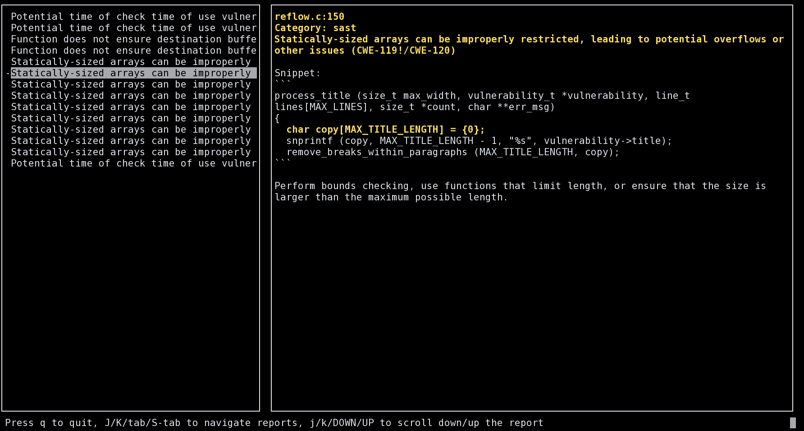

# Sasty

Sasty is a ncurses interface to read [Gitlab's SAST reports](https://docs.gitlab.com/ee/user/application_security/index.html#view-security-scan-information-in-merge-requests).



> Note for Github users : development is happening
> on [Gitlab](https://gitlab.com/oelmekki/sasty), please submit any issue
> there or merge request there.

## Dependencies

Sasty depends on:

* gcc
* make
* pkg-config
* ncurses
* json-c

## Installation

```
make
sudo make install         # will install in /usr/local/bin
make install PREFIX=~/bin # to install somewhere else
```

## Usage

```
sasty [-h|--help] <file> 

Brings a ncurses interface to inspect Gitlab's SAST reports. 

You must provide a path to a downloaded JSON report. 
```

## Compatibility?

Note that it's the first time I publish a ncurses program, so I have no
clue if this will be cross-platform. If it doesn't build on your platform,
please let me know in the [issues](https://gitlab.com/oelmekki/sasty/-/issues).
